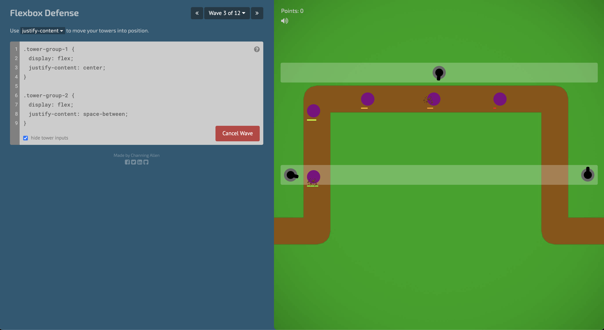

## [Display](https://developer.mozilla.org/en-US/docs/Web/CSS/display)
Свойство display определяет как будет отображаться элемент на страницу

* Block
* Inline
* Inline-block
* Flex
* Grid
* none


### Block
1. Занимает всю ширину
2. Всегда начинается с новой строки
3. Можно установить width & height
4. Блоки складываются вертикально


### Inline
1. Занимает ширину и высоту контента внутри него
2. Нельзя установить высоту
2. Блоки складываются горизонтально
3. Есть только левый и правый margin


### Inline Block
1. Все что характерно для inline
2. Можно задать высоту и ширину
3. Обладают внешними и внутренними отступами

## Flex
[Visual Cheat Sheet](https://flexbox.malven.co/)


#### Свойства

* flex-direction: Это свойство определяет основную ось, вдоль которой располагаются гибкие элементы. Оно может принимать следующие значения: row, row-reverse, column или column-reverse.
* flex-wrap: Определяет, должны ли гибкие элементы переноситься на новую строку или нет, когда их не хватает места в контейнере. Может быть nowrap, wrap или wrap-reverse.
* flex-flow: Это удобное свойство, которое объединяет flex-direction и flex-wrap.
* justify-content: Определяет выравнивание элементов вдоль основной оси. Может быть flex-start, flex-end, center, space-between, space-around или space-evenly.
* align-items: Определяет выравнивание элементов вдоль поперечной оси. Может быть flex-start, flex-end, center, baseline или stretch.
* align-content: Определяет выравнивание строк (не отдельных элементов) вдоль поперечной оси, когда в контейнере доступно дополнительное пространство. Это свойство влияет только на контейнеры с многими строками. Может быть flex-start, flex-end, center, space-between, space-around, space-evenly, или stretch.
```css 
.container {
    display: flex;
    flex-direction: row;
    flex-wrap: wrap;
    justify-content: space-between;
    align-items: center;
} 
```


Свойста flex item или дочерних элементов
* flex-grow: Это свойство определяет способность Flex элемента расти, если в контейнере есть свободное пространство. Значение определяет "ростовой фактор", т.е. во сколько раз пространство будет больше, чем у остальных элементов. Значением по умолчанию является 0.
* flex-shrink: Это свойство определяет способность Flex элемента уменьшаться, если в контейнере не хватает места. Значение определяет "фактор сжатия". Значением по умолчанию является 1.
* flex-basis: Это свойство задает начальный размер Flex элемента перед тем, как применяются свойства flex-grow или flex-shrink. Это может быть конкретное значение (например, "200px", "30%", и т.д.), или ключевое слово "auto", которое означает "использовать размер содержимого".
* flex: Это обобщенное свойство, которое задает flex-grow, flex-shrink и flex-basis в одном коротком значении. Например, flex: 1 0 auto;.
* align-self: Это свойство позволяет устанавливать выравнивание каждого отдельного Flex элемента, переопределяя align-items установленное в Flex контейнере. Значения могут быть: stretch, flex-start, flex-end, center, baseline или auto.
```css
.item {
  flex-grow: 1;
  flex-shrink: 0;
  flex-basis: auto;
  align-self: center;
}
```

[Сайтик где можно потренироваться в написании flex контейнеров](https://flexboxfroggy.com/)

[Сайтик где можно потренироваться в написании flex контейнеров](http://www.flexboxdefense.com/)


## [Grid](https://developer.mozilla.org/en-US/docs/Web/CSS/grid)
[Visual Cheat Sheet](https://grid.malven.co/)

* display: Это свойство определяет, является ли элемент контейнером grid. Значениями могут быть grid или inline-grid.
* grid-template-columns, grid-template-rows: Определяет размеры и количество треков колонок и строк. Размеры могут быть определены в единицах измерения или с использованием fr (занимает доступное свободное пространство).
* grid-gap: Определяет размеры промежутков между элементами сетки. Оно может применяться отдельно как grid-row-gap и grid-column-gap.
* grid-auto-columns, grid-auto-rows: Определяет размеры треков созданных автоматически.
* grid-auto-flow: Определяет, как должны располагаться автоматически создаваемые элементы: по строкам или колонкам.
* justify-items, align-items: Определяет выравнивание элементов вдоль осей.
* justify-content, align-content: Определяет выравнивание самой сетки внутри своего контейнера.
* grid-template-areas: Определяет шаблон сетки с помощью имен областей.

```css 
.container {
  display: grid;
  grid-template-columns: 1fr 2fr 1fr;
  grid-template-rows: auto;
  grid-gap: 20px;
  justify-content: center;
  align-content: start;
}

```

Свойста дочерних элементов
* grid-column-start / grid-column-end, grid-row-start / grid-row-end: Определение позиции элемента относительно линий сетки. Номера линий начинаются с 1. Вместо чисел можно использовать span для указания на сколько линий должен распространиться блок.
* grid-column, grid-row: сокращенная запись начала и конца для строк и столбцов. Например, grid-column: 1 / 3 означает, что элемент начнется с первой вертикальной линии и закончится до третьей.
* grid-area: Это свойство может использоваться тремя способами: для определения имени элемента сетки, для определения позиции элемента посредством стартовых и конечных точек, или и того и другого вместе.
* justify-self , align-self: Эти свойства определяют выравнивание элемента сетки внутри ячейки по оси блока или поперечной оси. Значения могут быть start, end, center, stretch.
* place-self: обобщенное свойство для justify-self и align-self.


```css
.item {
    grid-column-start: 1;
    grid-column-end: span 3;
    grid-row: 2 / 4;
    justify-self: stretch;
    align-self: center;
}
```

```css
grid-template-columns: 100px repeat(auto-fill, 100px) 200px;
grid-template-columns: 100px repeat(2, 1fr auto) 200px repeat(3, 5fr);
grid-template-columns: minmax(150px, max-content) repeat(auto-fill, 180px) 15%;
grid-template-columns: [col1] 100px [col1-end] repeat(auto-fit, [line3] 400px);
```

```css
grid-template-columns: 200px 1fr 180px;
grid-template-columns: [linename col1] 250px [line2];
grid-template-columns: [sidebar] 1fr [content] 2fr;
grid-template-columns: fit-content(50%);
grid-template-columns: minmax(200px, 1fr) minmax(100px, 1fr);
grid-template-columns: repeat(4, 1fr);
```

# [Position](https://developer.mozilla.org/en-US/docs/Web/CSS/position)
* Static
* Relative
* Absolute
* Fixed
* Sticky

## Relative
Свойство position: relative; позиционирует элемент относительно его нормальной позиции.
Если указаны координаты (top, right, bottom, left), элемент сместится в относительно его нормальной позиции. Например, если вы укажете top: 10px;, элемент сдвинется вниз на 10 пикселей от того места, где он должен был находиться.


## Absolute
CSS свойство position со значением absolute используется для позиционирования элемента абсолютно в отношении ближайшего предка (вместе с position: relative, position: absolute, position: fixed или position: sticky), или в отношении блока начального контейнерного элемента браузера, если такого предка нет.

```css
.parent {
  position: relative; /* make it a positioned parent */
}

.absolute-element {
  position: absolute;
  top: 10px; 
  right: 20px;
}
```

## Fixed
Удаляет элемент из потока документа, и на его месте не остается "заглушки". Элемент с таким позиционированием всегда оставляется в том же месте даже при прокрутке страницы. Местоположение fixed элемента задается с помощью свойств top, right, bottom и left.
```css
.fixed-element {
  position: fixed;
  top: 0px; 
  right: 0px;
}
```
С помощь fixed можно создать навигацию или уведомления которые всегда будут на экране


## Sticky
CSS свойство position с значением sticky представляет собой гибрид относительного (relative) и фиксированного (fixed) позиционирования. Элемент с position: sticky; ведёт себя как элемент с position: relative; до тех пор, пока он не достигнет определённой позиции относительно вьюпорта, после чего начинает вести себя как position: fixed;.
```css
.sticky-element {
  position: sticky;
  top: 0;
}
```

position: sticky; широко используется для создания "липких" заголовков таблиц или меню навигации.


### Z-Index

CSS свойство z-index используется для определения "слоев" элементов на странице по оси Z (глубина). Значение z-index определяет, какие элементы переднего плана и какие будут на заднем плане.

1. Держите z-index низким: Старайтесь использовать как можно меньшие значения z-index. Это делает управление z-index проще, поскольку есть меньше "слоев" для управления.
2. Используйте инкременты ровно: Привычка использовать z-index с большим инкрементом (например, 100, 200, 300) может быть полезной стратегией, позволяя вам вставить дополнительные слои между существующими, если это будет необходимо.
3. Создание переменных для управления z-index: Большие проекты часто используют CSS или SASS переменные для управления z-index. Это делает переиспользование значений z-index проще и позволяет обеспечивать их централизованное управление.
