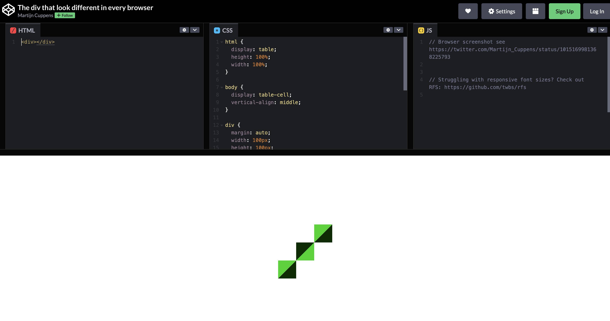
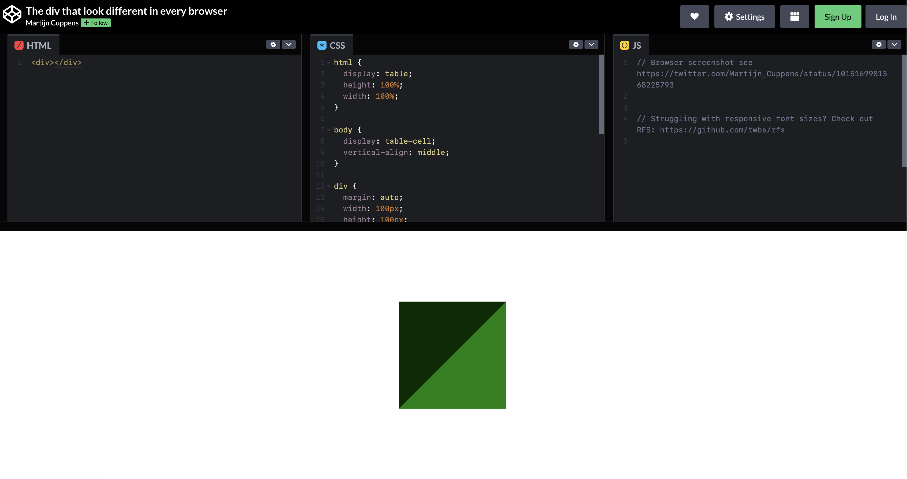
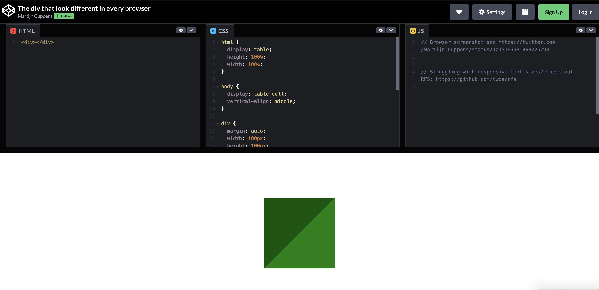

 # CSS reset


[Один и тот же css в разных браузерах](https://codepen.io/MartijnCuppens/pen/MXojmw)




Каждый браузер устанавливает свои значения стилей по умолчанию для различных HTML-элементов. С помощью CSS Reset мы можем нивелировать эту разницу для обеспечения кроссбраузерности стилей.

Интересно: Браузер может брать системные цвета в свои свой дефолтный css

### Универсальный селектор  
```css
 * {
  margin: 0;
  padding: 0;
 }
```


### Отдельно под тег
```css
:link,:visited { 
  text-decoration: none; 
}
ul, ol { 
  list-style: none; 
}
h1,h2,h3,h4,h5,h6,pre,code { 
  font-size: 1em; 
}
ul,ol,li,
h1,h2,h3,h4,h5,h6,
pre,body,html,p,blockquote,
form,fieldset,input { 
  margin:0; 
  padding:0; 
}
a img,
:link img,
:visited img {
  border:none; 
}
address { 
  font-style: normal;
}
```

**Библиотеки стилей в основном делают reset за вас (tailwind, bootstrap)**

[Подробнее можно прочитать тут](https://habr.com/ru/articles/45296/)

[Подробнее можно прочитать тут](https://habr.com/ru/companies/otus/articles/580442/) 
